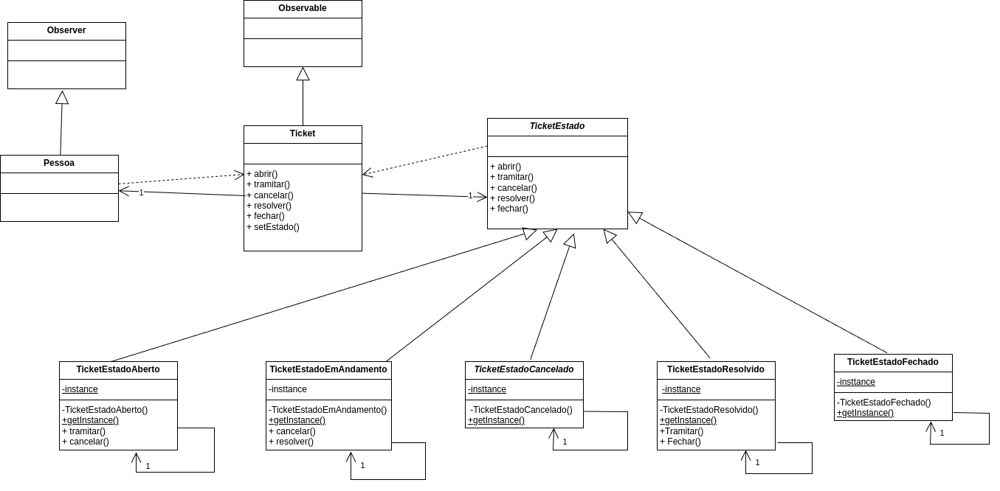

# Ticket - Padrões de Projeto

Este é projeto que implementa dois padrões de projeto principais: **Observer** e **State**. O projeto prever gerenciar de forma eficiente o ciclo de vida dos tickets, permitindo que seu estado seja alterado dinamicamente enquanto mantém o solicitante informado em tempo real.

---
## Diagrama de Classes

---

## Diagrama de Estados

---
